# Arquitectura detallada NewsAnalyzer-RAG (Mermaid)

> Diagramas **lo más completos posible** respecto al código en `app/backend`, `app/frontend` e infra `app/docker-compose.yml`.  
> **Leyenda**: **D** = determinístico (reglas, heurísticas, SQL, vectores fijos). **LLM** = llamada a modelo generativo (OpenAI / Ollama / Perplexity). **LG** = flujo **LangGraph** (grafo de estados con reintentos). No hay “agentes” autónomos con herramientas en bucle; el único flujo multi-paso orquestado es **insights** vía LangGraph + cadenas.

**Referencias de código**: `app/backend/app.py`, `app/backend/rag_pipeline.py`, `app/backend/database.py`, `app/backend/migrations/*.py`, `core/`, `adapters/`, `pipeline_states.py`.

---

## 1. Hexagonal: capas y carpetas

```mermaid
flowchart TB
    subgraph Driving["🔷 Driving adapters — entrada"]
        direction TB
        R_AUTH["routers/auth.py"]
        R_DOC["routers/documents.py"]
        R_DASH["routers/dashboard.py"]
        R_WORK["routers/workers.py"]
        R_REP["routers/reports.py"]
        R_NOT["routers/notifications.py"]
        R_Q["routers/query.py"]
        R_ADM["routers/admin.py"]
        R_NEWS["routers/news_items.py"]
        MW["middleware.py — JWT, roles"]
        SCH["schemas/*.py — Pydantic"]
        LEG["app.py — endpoints legacy + lifespan + schedulers"]
    end

    subgraph Core["🔶 Core (dominio + casos de uso)"]
        direction TB
        ENT["entities: Document, NewsItem, Worker, StageTimingRecord"]
        VO["value_objects: DocumentId, TextHash, PipelineStatus…"]
        DSVC["domain/services: insight_parser.py"]
        ASVC["application/services: InsightsWorkerService"]
        EVT["domain/events + EventBus (in-memory)"]
        P_REP["ports/repositories: DocumentRepository, NewsItemRepository, WorkerRepository, StageTimingRepository"]
        P_LLM["ports/llm_port.py: LLMPort, LLMChainPort, LLMRequest/Response"]
    end

    subgraph Driven["🔹 Driven adapters — salida"]
        direction TB
        PG_DOC["PostgresDocumentRepository"]
        PG_NEWS["PostgresNewsItemRepository"]
        PG_W["PostgresWorkerRepository"]
        PG_ST["PostgresStageTimingRepository"]
        G_INS["graphs/insights_graph.py — LangGraph"]
        C_EXT["chains: ExtractionChain, AnalysisChain, InsightsChain"]
        PRV["providers: OpenAIProvider, OllamaProvider"]
        MEM["memory/insight_memory.py — LangMem → insight_cache"]
        LEGDB["database.py — *Store legacy"]
    end

    subgraph Infra["Infra compartida (no hex puro)"]
        RAG["rag_pipeline.RAGPipeline"]
        OCR["ocr_service → HTTP ocr-service"]
        QD["qdrant_connector.QdrantConnector"]
        EMB["embeddings_service / PerplexityEmbeddingsService"]
        FILE["file_ingestion_service"]
        BS["backup_scheduler.BackupScheduler"]
    end

    Driving --> MW
    MW --> Core
    Core --> P_REP
    P_REP --> PG_DOC & PG_NEWS & PG_W & PG_ST
    ASVC --> MEM
    ASVC --> G_INS
    G_INS --> C_EXT
    C_EXT --> PRV
    LEG --> RAG & OCR & QD & EMB & FILE & LEGDB & Core
```

---

## 2. Puertos (interfaces) ↔ implementaciones

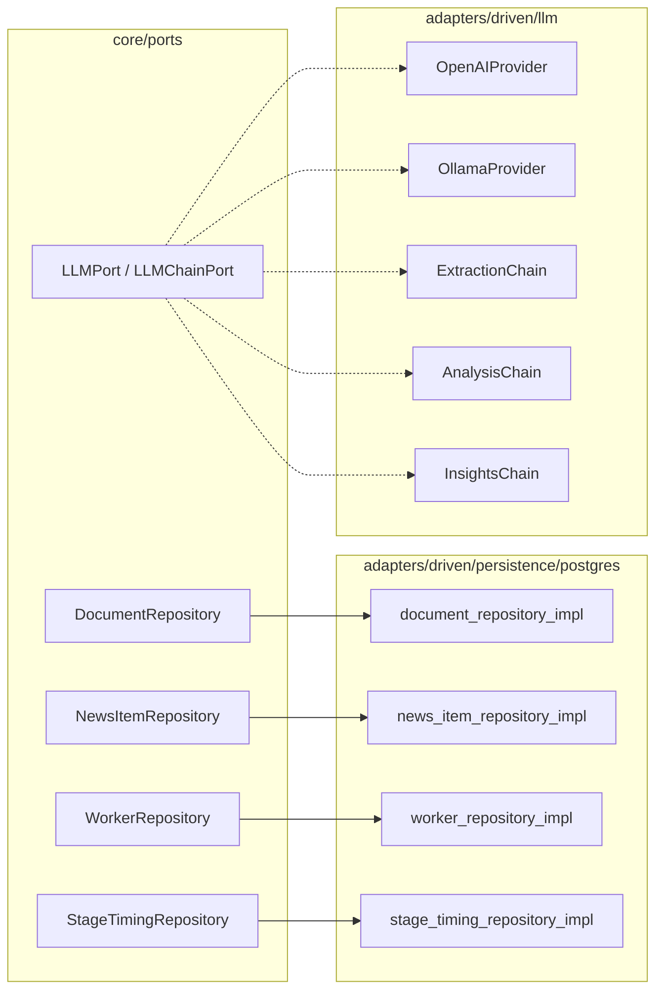

---

## 3. Entidades de dominio (resumen)

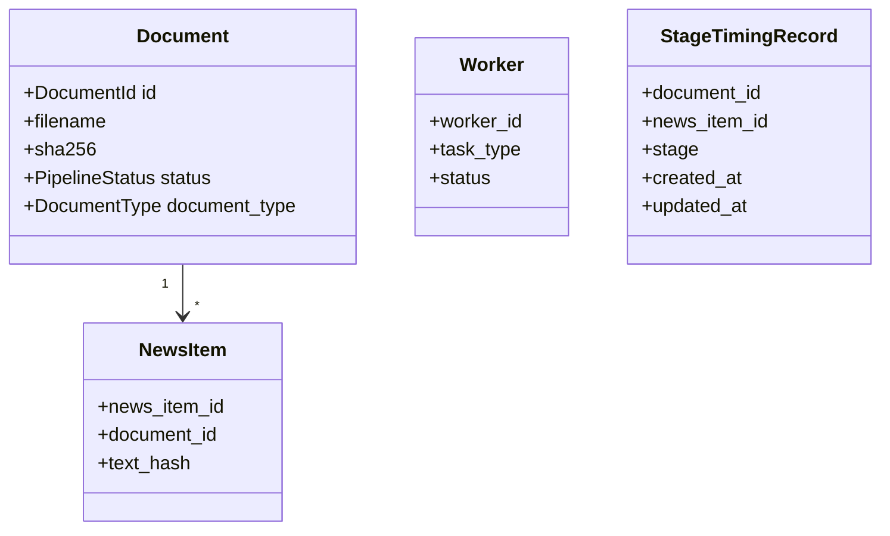

---

## 4. PostgreSQL: tablas (migraciones)

| Tabla | Migración / rol |
|-------|-------------------|
| `users` | 001 — auth |
| `document_status` | 002 — estado pipeline, OCR text, reprocess |
| `worker_tasks`, `processing_queue` | 003 — cola event-driven + semáforo |
| `document_insights` | 004 — insights legacy a nivel documento |
| `news_items`, `news_item_insights` | 005 — noticias + insights por ítem |
| `daily_reports`, `weekly_reports` | 006 |
| `notifications`, `notification_reads` | 007 |
| `ocr_performance_log` | 011 |
| `pipeline_runtime_kv` | 016 — pausas / config runtime JSONB |
| `insight_cache` | 017 — LangMem (dedup por `text_hash`) |
| `document_stage_timing` (+ triggers varios) | 018 — auditoría por stage |

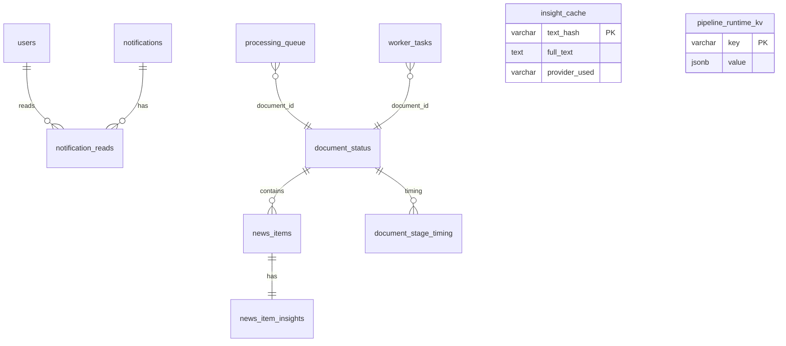

---

## 5. Qdrant y volúmenes (fuera de Postgres)

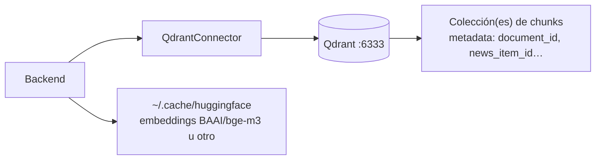

---

## 6. Contenedores Docker (red `rag-network`)

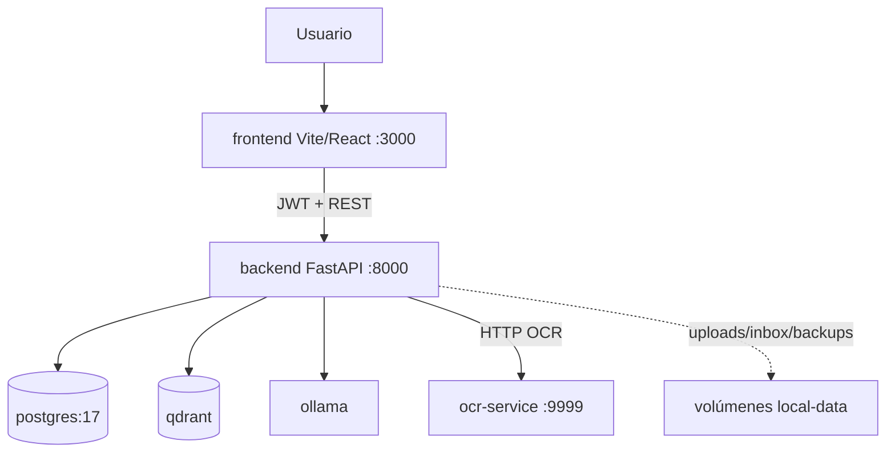

---

## 7. Pipeline de documento: etapas y naturaleza (D vs LLM)

Orden lógico de **estados** (`pipeline_states.py`): `upload_*` → `ocr_*` → `chunking_*` → `indexing_*` → `insights_*` → `completed`.

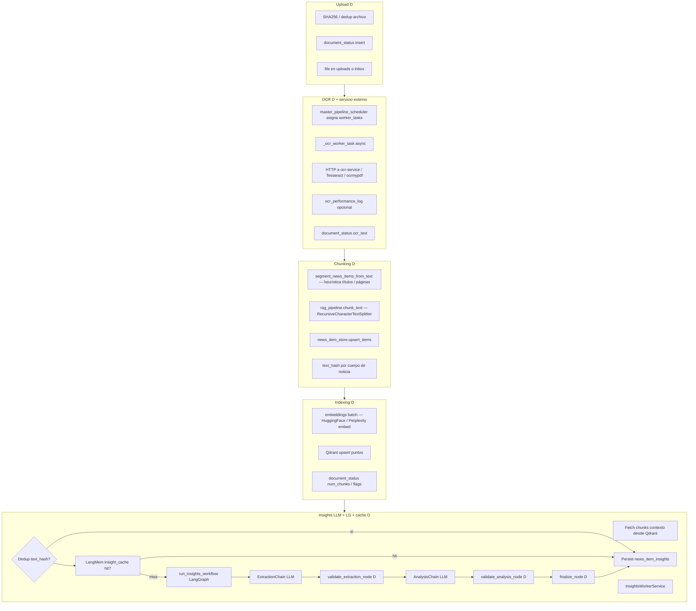

**`TaskType`** (`processing_queue` / `worker_tasks`): `ocr`, `chunking`, `indexing`, `insights`, `indexing_insights`.  
**`QueueStatus`**: `pending`, `processing`, `completed`.  
**`WorkerStatus`**: `assigned`, `started`, `completed`, `error`.

---

## 8. Orquestación: `master_pipeline_scheduler` + colas

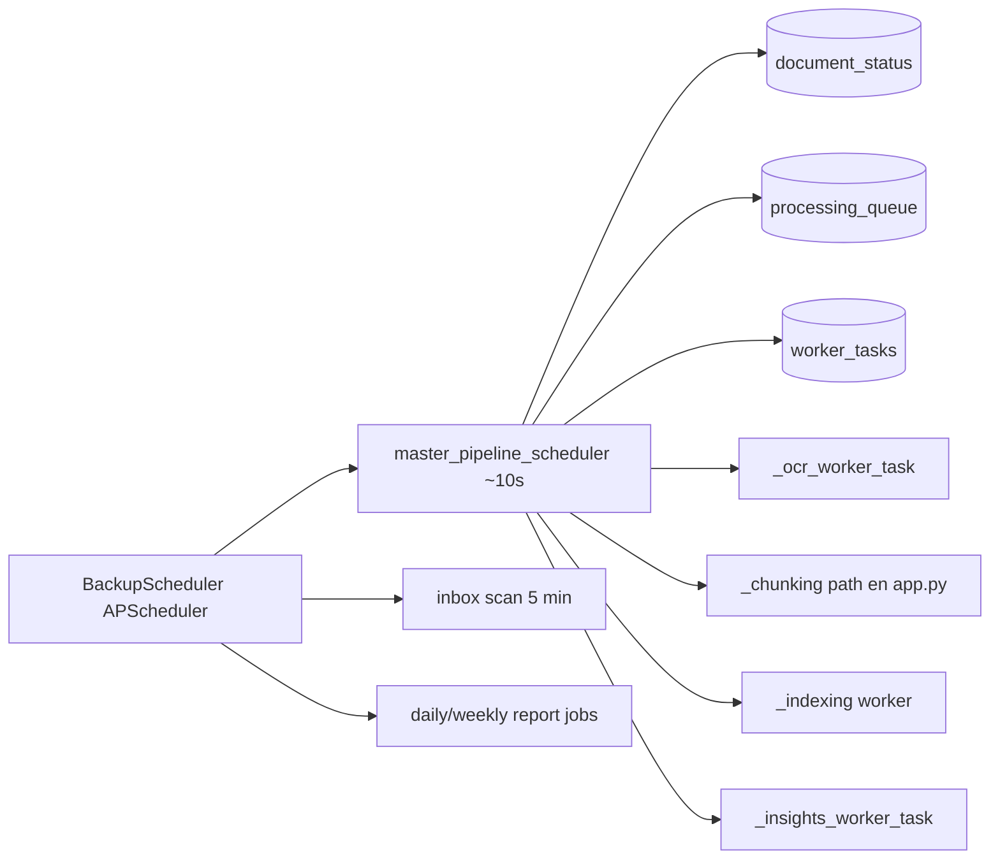

---

## 9. LangGraph: grafo de insights (nodos y ramas)

Flujo real (`adapters/driven/llm/graphs/insights_graph.py`).

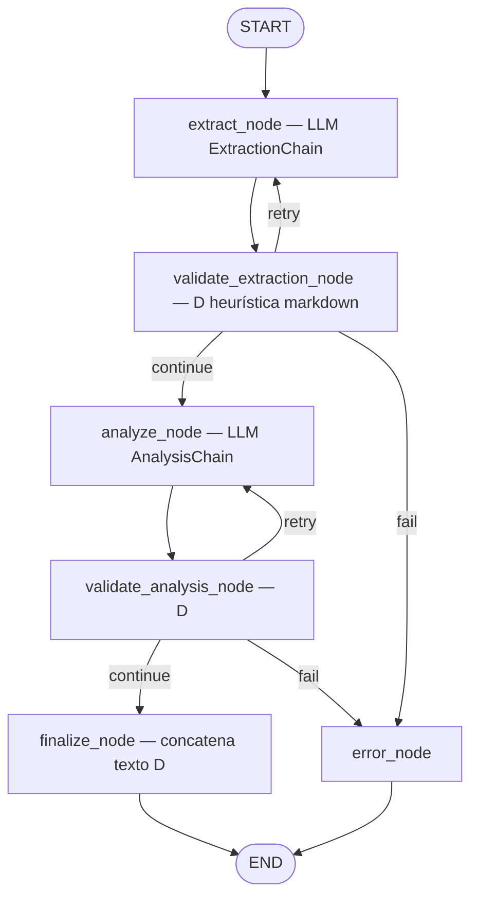

---

## 10. Consulta RAG (chat): embedding D + búsqueda D + respuesta LLM

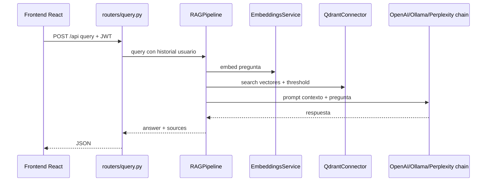

---

## 11. Frontend (capa presentación)

SPA **React** (`app/frontend/src`), build **Vite**, consume API vía `VITE_API_URL`. Componentes de dashboard (ej. `PipelineDashboard.jsx`, `WorkerLoadCard.jsx`, gráficos Sankey) hablan con `/api/dashboard`, `/api/workers`, etc.

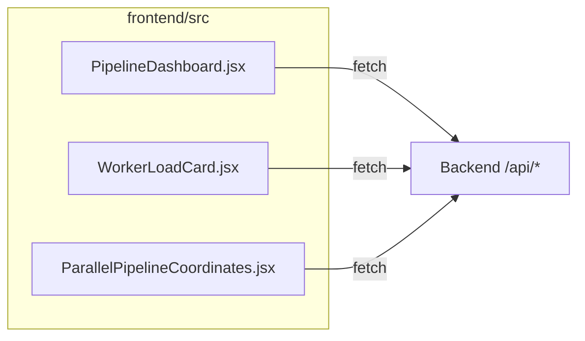

---

## 12. Coexistencia legacy vs hexagonal

**Stores legacy** (`database.py`, conviven con repositorios):

| Clase | Responsabilidad principal |
|-------|---------------------------|
| `DocumentStatusStore` | Fila `document_status`, estado pipeline |
| `ProcessingQueueStore` | `processing_queue` |
| `DailyReportStore` / `WeeklyReportStore` | Reportes |
| `NotificationStore` | `notifications` + lecturas |
| `DocumentInsightsStore` | `document_insights` |
| `NewsItemStore` | `news_items` |
| `NewsItemInsightsStore` | `news_item_insights` |

```mermaid
flowchart TB
    subgraph New["Patrón nuevo"]
        REPOS[Ports + Postgres*Repository]
    end
    subgraph Old["Legacy en transición"]
        STORES[Stores en database.py]
    end
    APP[app.py]
    APP --> REPOS
    APP --> STORES
    ROUTERS["routers v2"] --> REPOS
    ROUTERS --> APP module globals
```

---

## Notas de precisión

1. **Determinista** no implica “rápido”: OCR e embeddings pueden ser costosos, pero **no son generación libre con LLM**.
2. **Insights**: los nodos `validate_*` son **reglas sobre texto** (presencia de secciones `## Metadata`, longitud mínima, etc.), no otro LLM.
3. **`document_insights`** (tabla a nivel documento) coexiste con **`news_item_insights`** (por noticia); el flujo principal de producción para el dashboard de noticias es por **news item** + LangGraph.
4. **`EventBus`** está en core pero la orquestación pesada sigue en **`app.py`** + schedulers; conviene ver esto como evolución incremental REQ-021.

---

## Cómo visualizar

| Herramienta | Uso |
|-------------|-----|
| Preview Markdown en IDE | Ver diagramas embebidos |
| https://mermaid.live | Pegar **un bloque** `mermaid` si el render falla por tamaño |
| GitHub / GitLab | Vista previa del `.md` |

Si algún diagrama supera el límite del renderizador, **copia solo ese bloque** a Mermaid Live o divídelo en dos `subgraph` más pequeños manteniendo los mismos nombres de archivo y clases.
